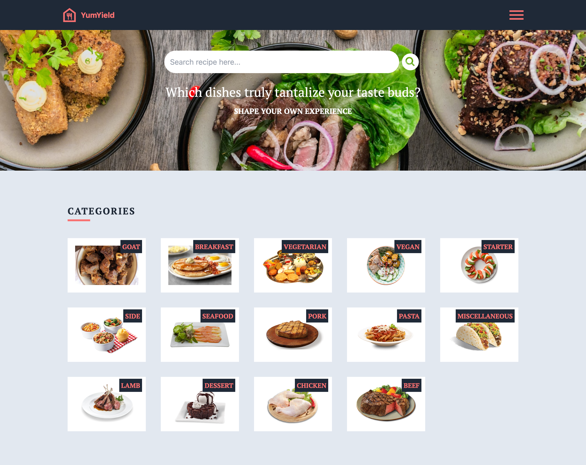

# yumYield

Welcome to yumYield, your ultimate recipe app built with HTML, Tailwind CSS, ReactJS, React Router, and Redux. This frontend application is designed to help users explore, search, and view detailed information about a variety of delicious meals.

## Table of Contents

- [Features](#features)
- [Screenshot](#Screenshot)
- [Technologies Used](#technologies-used)
- [Useful Resources](#useful-resources)
- [License](#license)

## Features

1. **Browse Meals:**

   - Explore a visually appealing display of mouthwatering meals.
   - Scroll through an enticing showcase of meal images and names.

1. **Search Meals:**

   - Utilize the search feature to find specific meals swiftly.
   - Input keywords or meal names for personalized results.

1. **View Meal Details:**
   - Click on a meal to access comprehensive details.
   - Discover ingredients, cooking instructions, and nutritional information.

### Screenshot

|  |  |
| --------------------------------------------------- | -------------------------------------------------- |

## Technologies Used

- HTML
- React
- React Router (for navigation)
- Redux (for state management)
- Tailwind CSS (for styling)

## Useful Resources

- [React Documentation](https://react.dev/): Official documentation for React.

- [React Router Documentation](https://reactrouter.com/en/6.20.1): Learn how to use React Router for navigation.

- [Redux Documentation](https://redux.js.org/introduction/getting-started): Official documentation for Redux state management.

- [Tailwind CSS Documentation](https://tailwindcss.com/docs): Explore the documentation for Tailwind CSS.

- [Google Fonts](https://fonts.google.com/): Browse and integrate beautiful fonts for your project.

## License

This project is licensed under the [MIT License](LICENSE).
